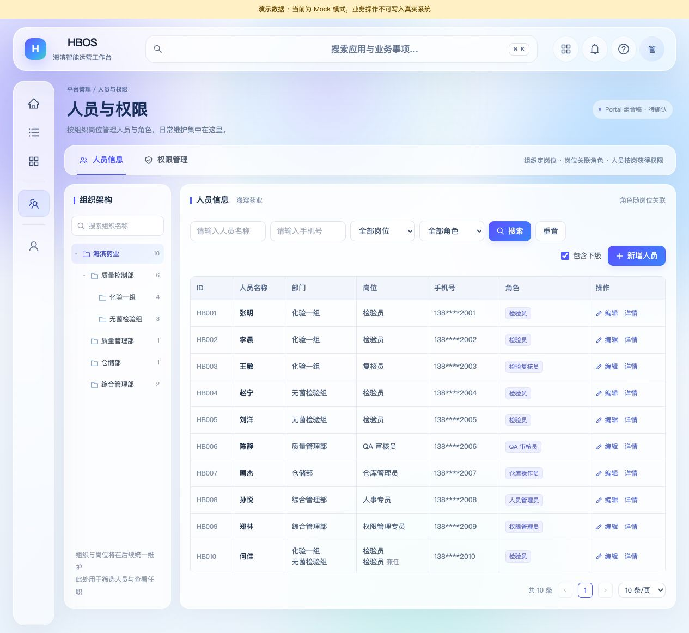
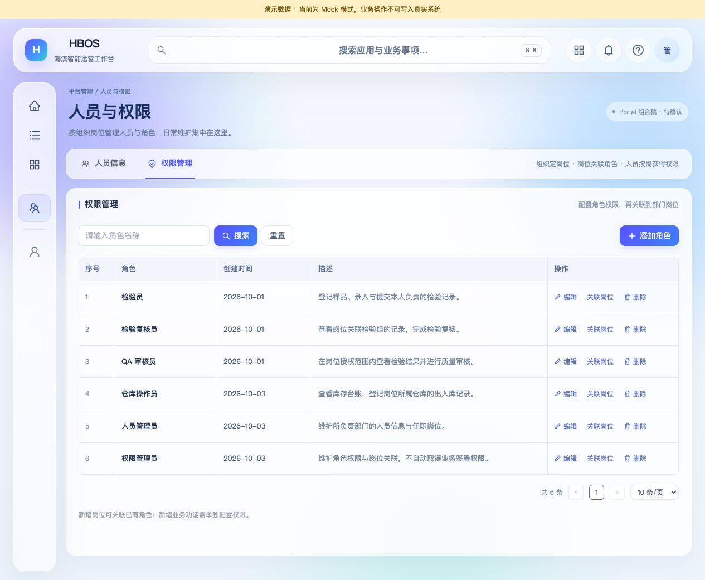
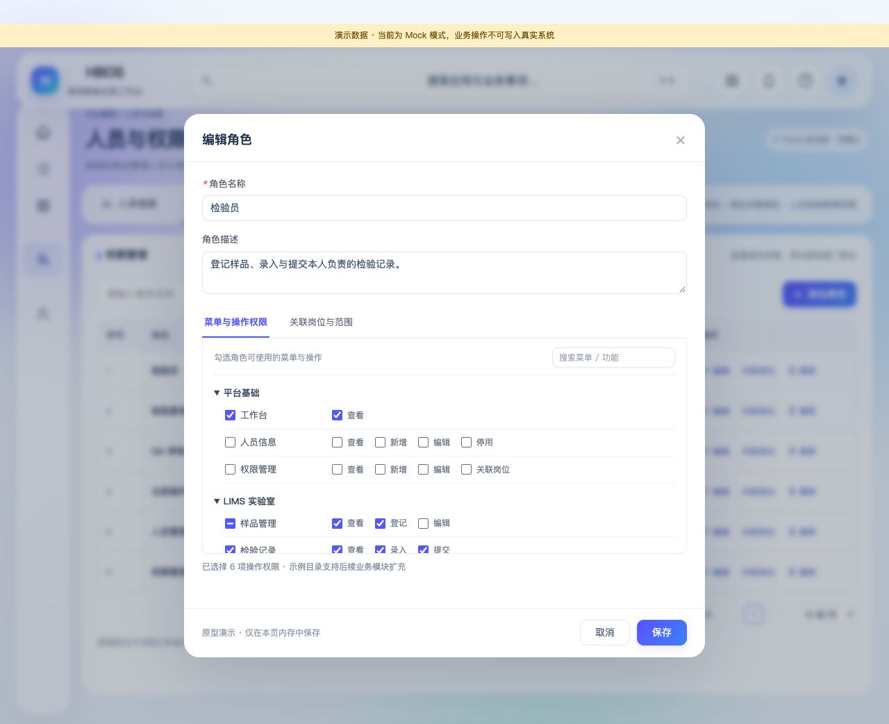

# 人员与权限管理：Portal 组合展示设计

- 日期：2026-10-08
- 状态：**PORTAL_COMPOSITE_PREVIEW_ACCEPTED / Owner 已确认，作为后续设计与复刻基线；未接入真实权限**。
- 最新接续：[前端复刻实施记录](人员与权限管理_前端复刻实施记录.md)：Owner 指示下一步，已完成 Mock Vue 复刻并验证，待查看。以下为此前组合原型交付与确认记录。
- 分支：`m2-r11@27d3558`；不创建或切换分支，不新增里程碑子轮。
- Owner 原话：“这个设计可接受，按照现有portal前端，结合这一版进行设计，让我看到在portal前端的展示”。因此 [V2 原型](人员与权限管理_岗位关联原型设计.md)的结构和交互已接受，本轮继续 Portal 组合设计，无须重新审批 V2。
- Owner 确认（2026-10-08）：“已确认，接受这一版原型图”。确认对象为 Portal 组合原型中的人员信息、权限管理、入口布局、视觉呈现与岗位角色交互，后续复刻以本版为准。
- 本轮主文档：本文。P4-F6-5 保持 REVIEWING，其他实施门禁不变。

## 1. 查看展示

- [人员信息](http://127.0.0.1:5197/hbos/admin/people)
- [权限管理](http://127.0.0.1:5197/hbos/admin/roles)
- [独立预览入口源码](prototypes/Portal人员权限预览/main.ts)

这是运行在 Vue / Ant Design Vue 中的 Portal 组合预览，端口为 5197。复用现有 Portal 的 `App.vue`、`GlobalHeader.vue`、`PointerAtmosphere.vue`、`CommandPalette.vue`，以及主题变量、全局布局与字体样式；不是另画一套顶栏。预览布局按现有 Portal 的顶栏、左侧导航和内容网格组织，增加候选管理入口。没有修改正式 `PortalLayout.vue`、`PortalSidebar.vue`、router、guard、登录逻辑、API 代理或其他应用源码。

正式 5178 Portal 仍为真实运行入口；此次没有向其注册管理页面或更改登录会话。所有合成人员、角色及演示操作位于独立预览内存，刷新恢复，不读取真实人员与权限。

## 2. 入口、布局与组件

| 区域 | 本次组合设计 |
| --- | --- |
| 顶栏 | 沿用现有 HBOS 标识、全局搜索、应用切换、帮助与个人菜单；演示模式的通知和提示由现有组件呈现 |
| 左侧导航 | 保留工作台 / 个人区域，中间增加“平台管理 → 人员与权限”候选入口 |
| 页面标题 | 人员与权限，说明按组织岗位管理人员与角色 |
| 页内导航 | 人员信息、权限管理两个页签；切换时地址同步为 people / roles，浏览器刷新可直接打开对应页面 |
| 人员信息 | 组织树、姓名 / 手机号 / 岗位 / 角色搜索、指定七列表格、分页；编辑与详情使用弹窗 |
| 权限管理 | 角色名称搜索、序号 / 角色 / 创建时间 / 描述 / 操作；编辑角色、关联岗位、删除 |
| 视觉 | 沿用 Portal 浅色玻璃背景、蓝紫按钮、圆角、字体与间距；内容表格保持 V2 的清晰分隔和紧凑密度 |

内容预览从已接受的 V2 派生，用 Shadow DOM 隔离演示样式和 DOM 事件，避免覆盖现有顶栏与导航。此为设计预览手段，不决定正式 Vue / Ant Design Vue 的组件拆分或 API 接入方式。预览导航为合成管理员视角；正式入口显隐和直接访问必须由同一后端授权核验，不根据展示导航推定任何账号获得管理权。

1280px 及以下沿用 Portal 的窄侧栏，并在预览内正确隐藏导航文字、保留图标与提示；没有修改正式 Portal 的响应式样式。手机宽度下使用底部导航、横向组织选择及表格内部滚动。当前已核对桌面浏览器，未进行真实移动设备验收。

## 3. 浏览器截图







另见[人员编辑](prototypes/Portal组合原型_04人员编辑.jpg)、[岗位关联](prototypes/Portal组合原型_05岗位关联.jpg)。截图使用刷新后的默认合成数据；没有复制现有 5178 会话中的人员信息。

## 4. 核对与运行方式

- 独立 mock 预览构建通过，产物仅写入 `/private/tmp/hbos-portal-iam-preview-build`；整套 Ant Design Vue 产生预览包体提示，本轮没有发布或进行正式性能优化。
- 独立预览的 Vue / TypeScript 类型检查通过；演示 JS 与 Vite 配置语法检查通过。
- Portal 中更改张明的岗位为复核员，差异可见，确认后列表显示检验复核员；页签切换同步预览路由。
- 角色取消“提交”后选择计数从 6 变为 5，范围页签可查看两个部门岗位；取消编辑保留原配置。
- 解除无菌检验组检验员岗位的角色关联，提示影响三名演示人员；确认后人员列表显示对应角色变化。浏览器无错误日志。
- 已目视核对人员页、角色页及三个弹窗，保存五张截图。没有重复运行无关的正式应用测试。
- API 路由的浏览器直达核对被客户端拦截，未取得 HTTP 响应；隔离依据为固定 mock、无代理、CSP 与拒绝中间件配置，不把此次客户端拦截作为真实后端权限验收。

从仓库根目录运行：

```sh
node frontend/hbos-portal-web/node_modules/vite/bin/vite.js --config 'docs/frontend/prototypes/Portal人员权限预览/vite.preview.config.mjs'
```

使用现有依赖，不安装软件；仅监听 `127.0.0.1:5197`。配置固定 mock 数据、无后端代理，并拒绝预览服务器的 `/api`、`/desk`、`/login` 等入口。页面 CSP 限制为预览同源资源及自身热更新连接，禁止外发表单。该配置位于文档原型目录，不修改正式构建 / CI / 生产路由；技术入口文件 `index.html`、`main.ts`、Vite 配置名沿用生态约定，其余新增设计资产采用中文或中英混合命名。

## 5. 继承的权限边界与后续

“组织中的具体岗位 → 关联角色与明确业务范围 → 人员任职”沿用 V2，同名岗位按所属部门区分，兼任逐条保留角色和范围，新增功能单独配置。统一 Frappe User、统一后端授权与各 App 业务校验不变；不建立另一套 Portal 用户库。

Owner 已确认 Portal 组合原型，设计基线已确定。本次只登记确认并同步文档，正式复刻与权限接入尚未启动；后续按 Owner 的下一步指令推进。具名人员授权、Q1 / Q2 业务口径及真实权限变更不在此次原型确认范围内，P1 PARTIAL / 实际盘点 NOT_RUN、S01—S06 NOT_STARTED / 验收 NOT_RUN 保持。第 4 节验证为组合预览交付时的证据，本次文档确认没有重复运行构建或业务测试。

`frontend-design` / `superpowers` 当前不可用，按项目规则人工执行，没有安装或替换其他 Skill。已同步 PROJECT_STATUS、CURRENT_MILESTONE、M2_START_GATE、README、AI_CONTEXT、READING_GUIDE；CLAUDE / AGENTS 保持协作规则职责。
