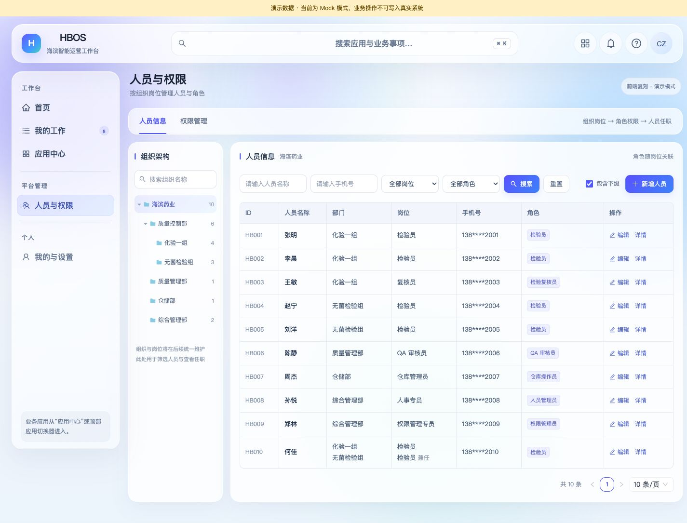
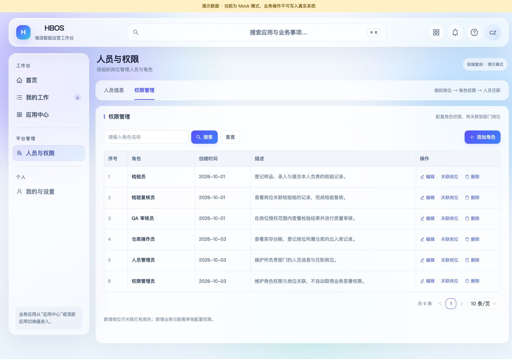

# 人员与权限管理：前端复刻实施记录

2026-10-10 最新接续：[原站只读预检](../milestones/M2_人员权限原站只读预检记录.md)已完成，**S02_ORIGINAL_READONLY_PREFLIGHT_COMPLETED / PARTIAL / REVIEWING / 5178_REAL_READONLY**。实际frontend / DB摘要精确匹配，五来源InnoDB与24必需列PASS，COUNT18/0/1/14/31；八管理表全缺，正式预检在tables以STORAGE_PREFLIGHT_SCHEMA_INVALID停止。10诊断SELECT含正式预检2，零transaction_writes、rollback/destroy PASS，未初始化。只读诊断完成不等于结构或启用PASS；管理GET仍NOT_READY。原站备份工具release路径缺失，现已有镜像 / 权限 / 磁盘 / 备份总量仅元数据确认，原样stdin备份操作包已准备但未执行。下一段先确定停写一致性窗口 / 原服务恢复措施，再按同次私有备份与隔离SQL恢复范围执行；不建表 / 人员 / 政策 / pins或启GET。5178既有真实只读；本段未改代码 / 配置 / 服务 / 缓存 / schema，未备份 / 恢复或浏览器复验。前段14原生 / 428离线PASS为历史证据，本段未重跑。S01-B/S02 PARTIAL，C/S03—S06 NOT_STARTED，Grant NOT_RUN，P4-F6-5 REVIEWING；原Q1/Q2、Date、固定P1 / 完整恢复 / Owner及管理门禁保留。 以下为前序交付当时的记录。

2026-10-09 最新接续：[管理边界与受控接口实施规格](../milestones/M2_人员权限管理边界与受控接口实施规格.md)已形成，状态 **S02_MANAGEMENT_API_SPEC_DRAFT / REVIEWING**。明确独立具名管理政策、完整规则及人员 / 组织范围、固定操作与期限、写请求回滚 / 重启和同键重放；24 项新政策 / 接口验收全部 NOT_RUN。本轮仅文档变更，未创建政策表 / 接口 / 真实配置，前序 134 项离线及 19 项数据库场景通过不覆盖本规格。下一段仅实现纯管理政策协议与离线判定，不连接 Site、不开放写 API；S01-B / S02 PARTIAL、C / S03—S06 未开始、真实岗位授权 NOT_RUN。5178 真实只读；具名管理人、Q1 / Q2、Date 资格、固定 P1 / 恢复 / Owner 门禁保留。以下为前序交付与设计历史。

2026-10-09 最新接续：[实时来源与管理边界验收](../milestones/M2_人员权限S01B实时来源与管理边界验收记录.md)的 **3 项并发回归已按 Owner“继续”指令补验 PASS**，此前审批连接中断的执行缺口已补齐。本次未修改源码，前段 134 项离线、10 项真实来源 / 管理边界及 6 项存储回归结果沿用，摘要核对一致；累计 **19 项实际数据库场景 PASS**。合成数据已清理，原生指纹一致、六表归零。状态仍 **S01_B_NATIVE_SOURCE_VALIDATED / PARTIAL / REVIEWING**，S01-B / S02 PARTIAL、C / S03—S06 未开始，真实岗位授权 NOT_RUN。下一步细化真实管理边界配置与受控接口；5178 真实只读，Q1 / Q2、具名管理人、员工资格、固定 P1 / 恢复 / Owner 门禁保留。下方保留前序设计与历史证据。

2026-10-09 最新接续：[S02 隔离数据库验收](../milestones/M2_人员权限S02隔离数据库验收记录.md)已完成，状态 **S02_PREVIEW_STORAGE_VALIDATED / PARTIAL / REVIEWING**。既有空 Preview 完成备份和六类 DocType 定向同步，物理约束 / UTC 精度、6 项实际事务 / ORM 测试、3 项独立连接并发验证及 121 项离线测试 PASS（新保护 4 + 前序回归 117）；合成数据已清理，原生数据指纹保持。5178 未迁移，服务默认关闭，保持真实只读。S01-B / S02 仍 PARTIAL，下一步补可信实时来源与来源变更 / 管理边界验证；C 与 S03—S06 NOT_STARTED。下方保留前序设计和交付证据，未建表 / 未验证描述仅代表当时状态。

2026-10-09 后续交付：[S01-B 来源适配基础](../milestones/M2_人员权限S01B来源适配实施记录.md)已实现，新增 37 项合成测试及 A 回归 28 项，共 65 项 PASS。真实加载、关系落库及人员生命周期待补，B 仍 PARTIAL；下一段实现 S02 基础岗位 / 任职存储与受控服务。本文件保留对应设计 / 交付证据，5178 运行方式未变。

2026-10-09 后端接续：[岗位任职存储与版本方案](../milestones/M2_人员权限岗位任职存储与版本方案.md)已形成 / REVIEWING，下一段先实施来源适配；本次没有修改前端，5178 继续真实只读，表格和弹窗沿用已确认设计。

## 最新接续：5178 真实入口与来源核验 — 2026-10-09

Owner 明确要求先同步 5178、退出演示模式，再执行下一步。当前使用 [5178 人员信息](http://127.0.0.1:5178/hbos/admin/people) / [权限管理](http://127.0.0.1:5178/hbos/admin/roles)：保留已确认布局，真实页面独立读取原生 User / Employee、Department 和 Role，服务端权限过滤及手机号脱敏，未接入的写操作禁用；不再以 5193 演示作为当前工作入口。当前站点员工为空，不用夹具补齐。2026-10-09 已完成[S01-B 字段与来源核验](../milestones/M2_人员权限S01B真实来源核验记录.md)：具体部门岗位 / 任职来源仍缺，B 保持 PARTIAL；本次没有变更前端或重跑前序测试。

S01-A 的纯协议校验已实现，整体 S01 PARTIAL；真实岗位关联、角色授权和审批仍未开放。前端本次 91 + 35 项回归、工程检查及真实构建通过；实际会话查看和私有截图、后端验证详见[5178 与 S01-A 主记录](../milestones/M2_人员权限5178接入与S01A实施记录.md)。下列 §1—§5 保留首次 Mock 复刻交付证据，其 Mock-only、路由拒绝和未启动表述均为历史，当前按本节及主记录接续。

- 日期：2026-10-08
- 当前状态：**FRONTEND_REAL_READONLY_REVIEWING / 5178_REAL_READONLY**；真实读取已接入，岗位授权和写入未接入，待 Owner 最终验收。
- 分支：`m2-r11@27d3558`，沿用 Owner 已指定分支；未创建或切换分支。
- 授权依据：Owner 已确认 [Portal 组合原型](人员与权限管理_Portal组合展示设计.md)，随后指示“下一步”。按[前端实施规范](FRONTEND_IMPLEMENTATION_GUIDE.md)进入前端复刻阶段，本轮不进入真实功能接入。
- 本轮主文档：本文。不新增里程碑子轮，P4-F6-5 仍 REVIEWING。

## 1. 查看与运行

- [人员信息](http://127.0.0.1:5193/hbos/admin/people)
- [权限管理](http://127.0.0.1:5193/hbos/admin/roles)

5193 使用实际 Portal 工程、路由、PortalLayout、桌面 / 手机导航、顶栏与主题，页面内容已拆为原生 Vue 组件。5197 保留已接受的组合原型；本轮没有覆盖原型资产。当前演示只修改合成数据内存，刷新恢复。

从 `frontend/hbos-portal-web` 目录运行本次使用的本机命令：

```sh
VITE_PORTAL_DATA_MODE=mock VITE_FRAPPE_PROXY_TARGET= VITE_FRAPPE_APP_ORIGIN= node node_modules/vite/bin/vite.js --host 127.0.0.1 --port 5193 --strictPort
```

沿用现有依赖，不安装软件。此进程仅监听本机，无后端代理；没有重启、改配或部署正式 5178 / Frappe 服务。

## 2. 交付与组件结构

| 交付 | 实现 |
| --- | --- |
| 页面入口 | `src/views/PeopleAccessDemoView.vue`：人员信息 / 权限管理页签与同源路由 |
| 人员信息 | `PeopleInformation.vue`：组织筛选、姓名 / 手机号 / 岗位 / 角色查询、七列表格、详情及分页 |
| 人员编辑 | `PersonEditor.vue`：主岗 / 兼任、状态、派生角色、任职变更前后确认；返回修改保留草稿 |
| 角色管理 | `RoleManagement.vue`：角色、创建时间、描述、编辑、关联岗位及删除 |
| 角色编辑 | `RoleEditor.vue`：功能目录勾选、搜索、关联岗位范围、选择计数；取消保留原配置 |
| 岗位关联 | `PositionAssociation.vue`：具体部门岗位、范围、人数及变更影响确认 |
| 关系展示 | `AssignmentSummary.vue`：任职逐条保留部门、岗位、角色与范围 |
| 展示数据 | `contracts/peopleAccessDemo.ts`、`data/mockPeopleAccess.ts`、`stores/peopleAccessDemo.ts`：仅供复刻的类型、合成目录与内存状态 |
| 页面样式 | `styles/peopleAccess.css`：限定 `iam-` 前缀，沿用 Portal 蓝紫主题、圆角、表格与弹窗 |

上述组件位于 `frontend/hbos-portal-web/src/components/peopleAccess/`。技术源码使用英文文件名以遵循现有 Vue / TypeScript 工程约定，新增交付文档与截图采用中文或中英混合命名。

功能目录按应用 / 菜单 / 稳定功能 ID 渲染，不在组件中枚举业务角色或具体操作。合成目录属于展示夹具，不是已接入的后端注册表；后续通过受控接口适配真实目录。新增目录项不会自动进入已有角色，未知功能不能保存。同名岗位按具体部门岗位 ID 区分，兼任的角色摘要去重、范围逐条展示，不实现授权判断引擎。

## 3. 隔离与阶段边界

管理导航只在 Mock 模式显示；真实模式直达两条管理路由仍被路由守卫拒绝，后端初始化失败也不放行。构建时按明确的数据模式选择组件，真实构建不生成本次 `PeopleAccessDemoView` 代码 / 样式包，也不包含本次合成人员夹具。内存展示 store 在真实模式下拒绝初始化。

本轮未新增真实 API、User / Employee / Department / 岗位对象、DocType、授权表或迁移；未修改任何真实人员、角色、权限、审批或审计。身份仍以统一 Frappe User 为目标，展示模型不是另一套 Portal 用户库。真实 API 权限及后端闭环尚未验收。

共享 PortalSidebar 同时补齐 768—1280px 窄侧栏的文字隐藏，保留图标和标题提示，避免导航挤成竖排。此响应式修正也适用于真实模式；真实模式的管理入口仍关闭。既有登录、会话、API 代理与其他任务源码变更保持原样。

Q1 审批方式、Q2 默认读取范围尚未确认；P1 PARTIAL / 实际盘点 NOT_RUN、S01—S06 NOT_STARTED / 验收 NOT_RUN 保持。本轮前端复刻不是这些后端实施段的放行，也不代表真实授权生效。

## 4. 验证证据

| 检查 | 结果 |
| --- | --- |
| Vitest | **85/85**，含本轮新增 **15** 项关系、表单交互、取消 / 确认、目录扩展及真实模式隔离验证 |
| Node 前端回归 | **35/35** |
| 工程检查 | typecheck、lint、Mock 内容 Gate、LIMS 前端契约均通过；`git diff --check` 通过 |
| 构建 | frappe 生产模式、mock 模式均通过；产物写入 `/private/tmp/hbos-iam-vue-real-build` 和 `/private/tmp/hbos-iam-vue-mock-build`，未发布 |
| 构建隔离 | 真实产物无本次复刻页面包及合成人员范围文案，Mock 产物包含对应页面和夹具 |
| 人员变更 | 张明检验员 → 复核员，确认前对照可见，确认后显示检验复核员 |
| 角色编辑 | 取消“提交”后 6 → 5，关联范围页签正常；取消不修改原角色 |
| 岗位联动 | 解除无菌检验组检验员岗位关联，提示涉及 3 人；确认后赵宁显示未关联角色，刷新恢复 |
| 分页 | 每页 5 条时第二页显示 HB006—HB010 |
| 响应式 | 1440 / 1280 / 768 / 390px 浏览器视口核对；页面无横向溢出，窄屏表格在容器内滚动；手机角色弹窗宽度受限，Escape 可关闭 |
| 浏览器日志 | 所查运行页无 error / warn 日志 |

现有 Ant Design / 孪生模块大包提示仍存在，本轮未扩大为打包优化任务。响应式证据来自浏览器视口，未进行实体移动设备验收；前端路由隔离不代替真实后端授权测试。

## 5. 展示截图





其他状态：[角色编辑](prototypes/人员权限前端复刻/03角色编辑_1440.jpg)、[岗位关联](prototypes/人员权限前端复刻/04岗位关联_1440.jpg)、[人员编辑](prototypes/人员权限前端复刻/05人员编辑_1440.jpg)、[手机人员页](prototypes/人员权限前端复刻/06人员信息_390.jpg)、[手机角色页](prototypes/人员权限前端复刻/07权限管理_390.jpg)、[手机角色编辑](prototypes/人员权限前端复刻/08角色编辑_390.jpg)。全部使用刷新后的默认合成数据。

## 6. 下一步与收尾

前序已补齐[岗位任职与角色关联后端契约](../plans/权限管理_岗位任职与角色关联后端契约.md)及[S01 首段范围](../plans/权限管理_S01首段实施范围与离线验收规格.md)。Owner 本次明确要求先同步 5178 真实入口，再执行下一步；真实只读页面与 S01-A 已实施，当前为 REVIEWING / 5178_REAL_READONLY，下一步核实 S01-B 目标来源。§4 保留首次 Mock 验证，本次前端 126 项及工程检查、真实查询结果见顶部主记录；不得将内存模型或离线 DTO 直接写入运行库。

`frontend-design` / `superpowers` 当前不可用，按项目规则人工复刻与核对，没有安装或替换 Skill，未调整 Skill 路由。状态台账、M2 Gate、公共入口与设计文档已同步；CLAUDE / AGENTS 检查后无需修改，继续只承载协作规则。未提交、推送或发布。
