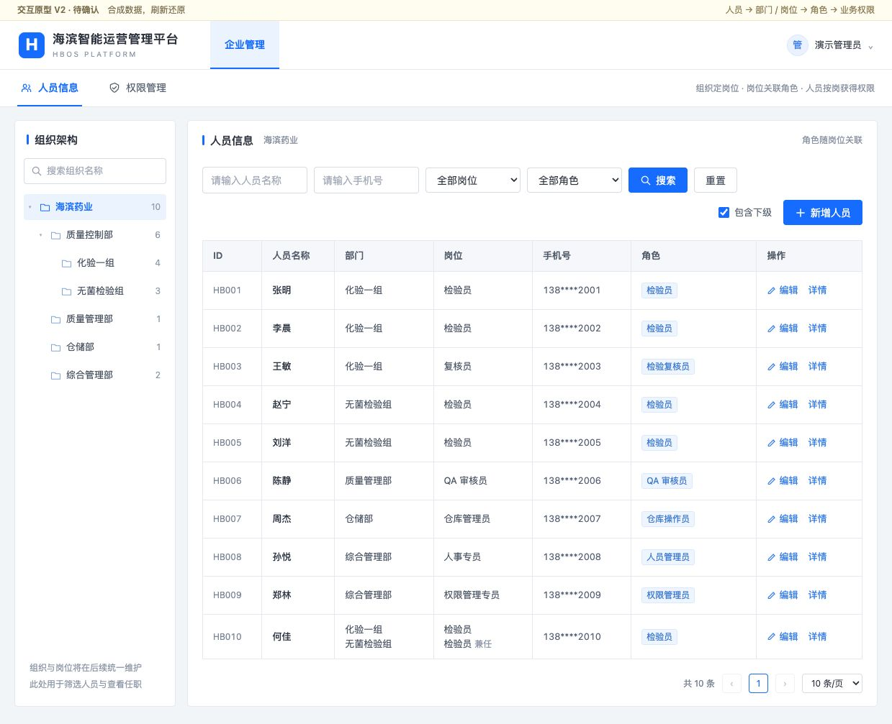
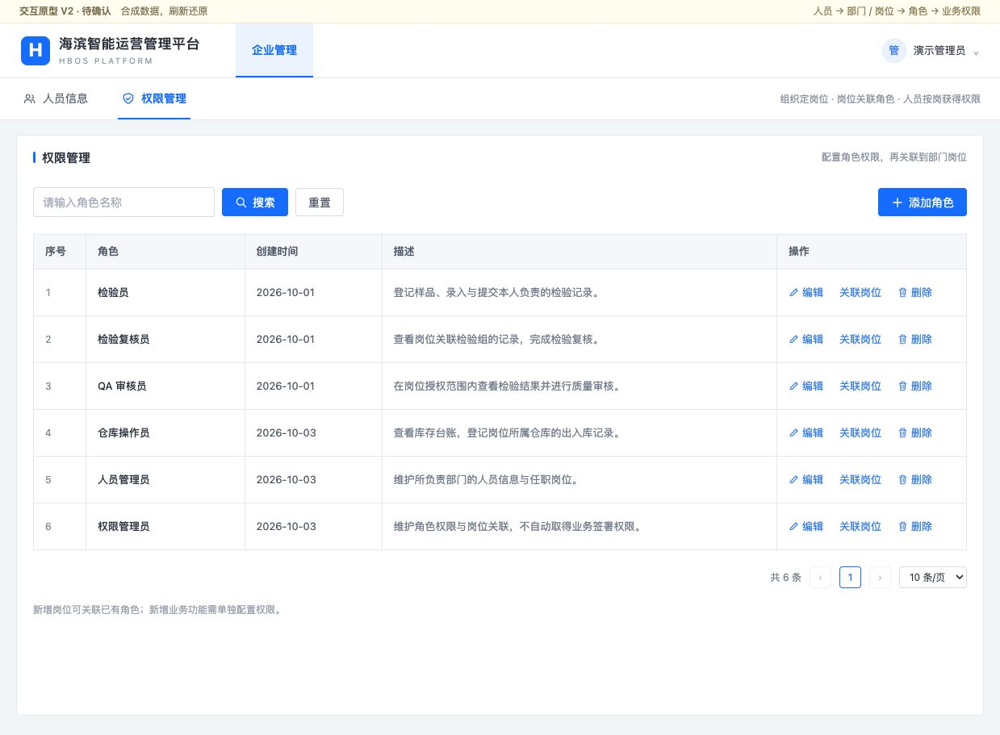
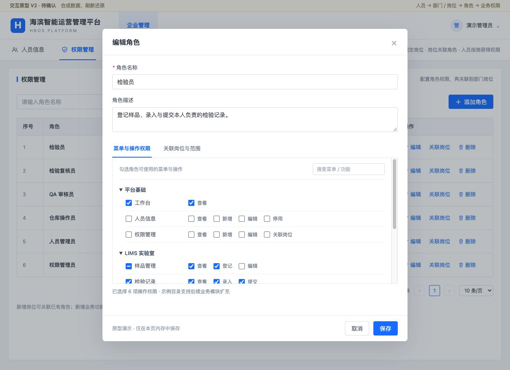

# 人员与权限管理：岗位关联原型 V2

- 日期：2026-10-08
- 状态：**UI_PROTOTYPE_V2_ACCEPTED / Owner 已接受结构与交互，未接入真实权限**。
- 最新接续：[Portal 组合展示设计](人员与权限管理_Portal组合展示设计.md)，按现有 Portal 组件与主题形成的可运行组合预览已获 Owner 确认（2026-10-08），作为后续复刻基线。
- 实施接续：[前端复刻记录](人员与权限管理_前端复刻实施记录.md)，仅 Mock 已验证，真实权限未接入。
- 工作分支：`m2-r11@27d3558`；未创建或切换分支，保留既有其他任务变更。
- 本轮主文档：本文。不新增里程碑子轮，P4-F6-5 保持 REVIEWING。
- 直接依据：Owner 明确否决上一版，并提供三张企业管理界面参考图；要求人员信息与权限管理两个页面，权限关联组织岗位，人员匹配岗位。
- [打开独立 HTML 原型](prototypes/人员信息与权限管理_岗位关联原型.html)。本机静态预览端口为 5196；也可直接打开 HTML 文件，无外部资源依赖。

## 1. 本次改版

上一版以人员授权、申请和审批为主要入口，Owner 认为使用不便，明确不采用。[旧版文档](权限管理_页面信息架构与原型.md)及其 SVG、PNG、HTML 保留为历史参考，状态改为 REJECTED / NOT_ADOPTED，不作为后续复刻依据。

新版以参考图的组织树、搜索、完整表格和居中弹窗为基础，使用 HBOS 品牌，不复制第三方品牌或设备业务。保留两个日常入口：**人员信息**、**权限管理**。申请审批、技术版本和授权记录不占据日常操作的主导航；后端审批和审计要求仍须在后续设计中落实。

## 2. 页面结构

| 页面 | 主体结构 | 核心操作 |
| --- | --- | --- |
| 人员信息 | 左侧组织树；右侧姓名 / 手机号 / 岗位 / 角色筛选、表格、分页 | 搜索、重置、包含下级、新增人员、编辑、详情 |
| 权限管理 | 角色名称搜索、角色列表、分页 | 添加角色、编辑、关联岗位、删除 |
| 人员编辑弹窗 | ID、姓名、手机号、状态、部门与岗位、只读关联角色 | 选择主岗、添加兼任岗位、保存；任职变更展示前后差异 |
| 角色编辑弹窗 | 名称、描述、菜单与操作权限、关联岗位与范围 | 勾选具体菜单操作、搜索功能、查看已关联岗位、保存 |
| 岗位关联弹窗 | 当前角色、部门岗位选择表、各岗位数据范围、涉及人数 | 选择岗位；变更前展示关联差异与受影响人数 |

人员表字段严格采用 Owner 指定的 **ID、人员名称、部门、岗位、手机号、角色、操作**。角色表采用 **序号、角色、创建时间、描述、操作**。人员角色来自任职岗位，不另设与岗位割裂的手工角色选择框。人员停用入口放在编辑弹窗中；角色已关联岗位时，先解除关联再删除演示角色。

布局采用白底、浅灰表头、蓝色主操作，字号以 13—14px 为主、间距以 8px 为基础、控件圆角 4px。延续现有 Ant Design Vue 的常规后台交互；本轮不引入组件库或新依赖。桌面宽度不足时筛选栏换行；1150px 以下表格在自身容器内横向滚动；700px 以下组织树改为横向组织选择，弹窗自适应宽度。

## 3. 人员、岗位、角色关系

```text
组织架构中的部门
    └── 具体岗位（部门 + 岗位标识 + 明确业务范围）
            └── 关联一个或多个角色（角色定义功能与操作）
                    └── 人员任职于该岗位，派生对应角色与范围
```

- 同名“检验员”岗位分别存在于化验一组与无菌检验组，按具体岗位标识区分，不能因为名称相同而取得另一组范围。
- 人员可兼任；列表汇总角色便于查看，详情仍逐条展示“部门 / 岗位 / 角色 / 范围”。角色、范围不跨任职自由组合。
- 范围文案仅用于关系示意；正式绑定以“具体岗位 × 角色 / 版本 × 应用 × 明确范围”为单位维护，须校验业务范围类型，不将岗位的一段文字通用于所有应用。本轮不实现或确认这些后端字段。
- “包含下级”只控制人员列表筛选，不代表权限自动向下继承。组织人数是合成数据的去重人员数，兼任不重复计算同一组织人数。
- 新岗位可复用已有角色；新增功能单独登记和配置，不默认加入已有角色。当前权限目录是原型数组，仓储明确为扩展示例，不表示真实模块已接入。
- 正式实现仍沿用一套 Frappe User 身份与统一后端授权事实，Portal / Desk 引用同一身份；人员信息页是统一人员主数据的候选管理视图，不建立独立 Portal 用户库。
- 岗位关联与任职变更的后端对象、范围维护、变更审批、生效及撤销机制须在下一步补齐；本轮没有改动后端契约、DocType 或权限实现。角色编辑的内存保存不表示已批准真实权限扩张或绕过版本管理。

## 4. 可查看的原型图

### 人员信息



### 权限管理



### 角色编辑



其他关键状态：[人员编辑](prototypes/岗位关联原型_04人员编辑.jpg)、[岗位关联](prototypes/岗位关联原型_05岗位关联.jpg)。以上为浏览器实际渲染的独立原型截图，全部人员、组织、手机号和角色是合成示例。

## 5. 确认范围与实施边界

Owner 已于 2026-10-08 明确表示“这个设计可接受”，接受两个入口的布局、表格字段、编辑方式及岗位角色关系；随后要求结合现有 Portal 继续设计。本次接受已记录，不再将 V2 标为待审。接续交付见 Portal 组合展示设计，真实权限接入与其他实施门禁仍未放行。

延续[前端实施规范](FRONTEND_IMPLEMENTATION_GUIDE.md)的原型先行流程。`frontend-design` / `superpowers` 当前环境不可用，按项目规则人工设计与核对，没有安装或替换 Skill。既有 Frappe / ERPNext 底座、模块化 App 架构和受限 Desk 维护入口不变。

HTML 仅操作内存，刷新恢复示例；没有 API、网络请求、账号操作、持久化或真实授权。CSP 禁止网络连接、表单外发和外部资源。没有改动正式应用、5178 服务、真实 Site、人员或权限；工作区其他任务的既有变更保留。

Q1 审批方式、Q2 检验员默认读取范围仍待确认；“本人负责记录”在岗位范围中明确标为口径待确认。P1 保持 PARTIAL / 实际盘点 NOT_RUN，后端 S01—S06 保持 NOT_STARTED / 验收 NOT_RUN。新版确认不会自动放行真实权限操作。

## 6. 原型核对记录

本节记录本轮独立 HTML 的核对结果，不代替正式业务测试、P1 盘点或 Owner 验收。

| 检查 | 结果与证据 |
| --- | --- |
| HTML 内联 JavaScript 语法 | Node `--check` 通过；没有外部 URL、网络调用或浏览器存储调用 |
| 人员搜索与组织筛选 | 姓名搜索返回张明一条；化验一组返回四名人员，包含兼任人员 |
| 人员岗位变更 | 张明从检验员改为复核员，前后角色差异可见；确认后列表显示检验复核员 |
| 角色勾选与切换页签 | 取消“提交”后已选项从 6 变为 5，切换范围页签再返回保留勾选状态 |
| 岗位关联联动 | 解除无菌检验组检验员岗位与检验员角色的关联，显示影响三名人员，确认后赵宁显示未关联角色 |
| 表单与分页 | 新增人员必填提示可见；新增兼任不丢失已选部门；每页五条翻至第二页显示 HB006—HB010 |
| 浏览器运行与视觉 | 无浏览器错误日志；已检查两个页面、人员编辑、角色编辑、岗位关联，五张截图使用刷新后的默认合成数据 |

本轮只核对独立原型，不重复运行与本次文档和设计资产无关的正式应用测试。正式授权、真实登录、实际业务范围及移动端设备验收均未执行。
