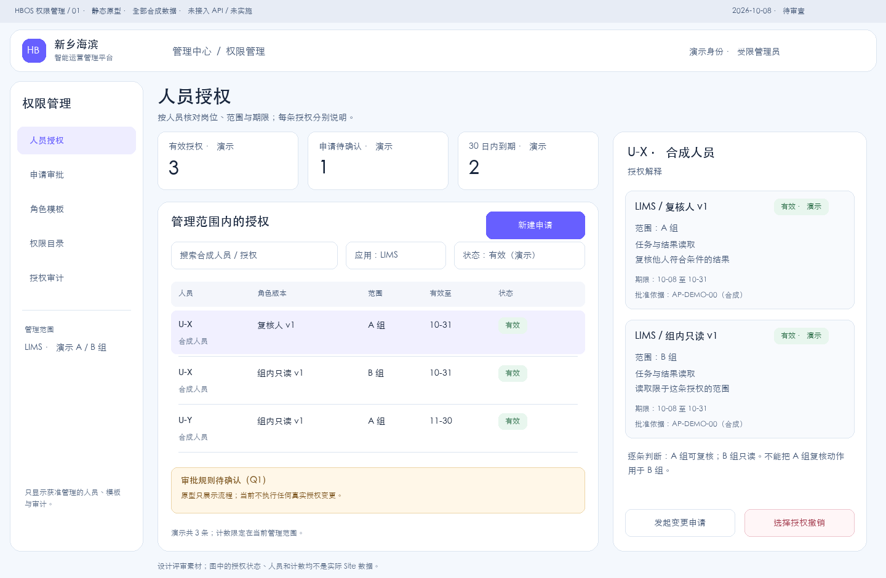
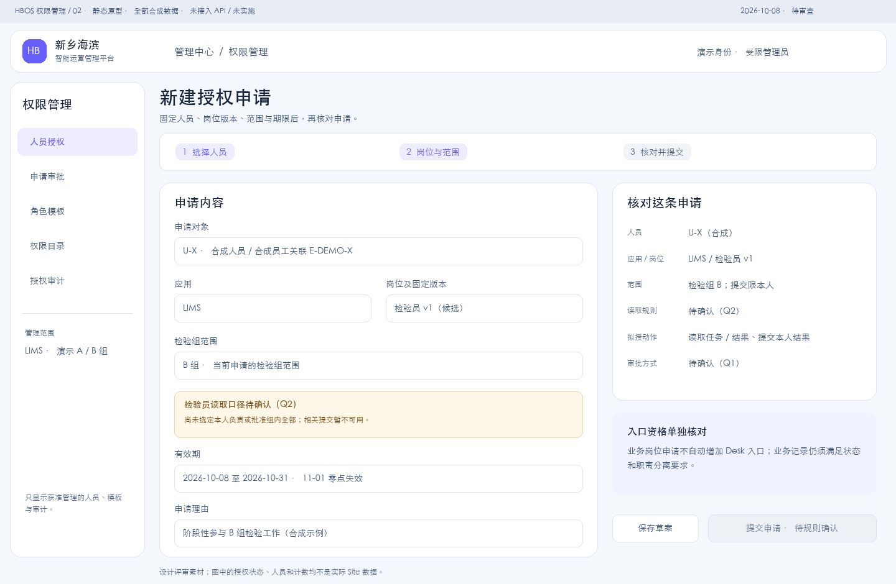
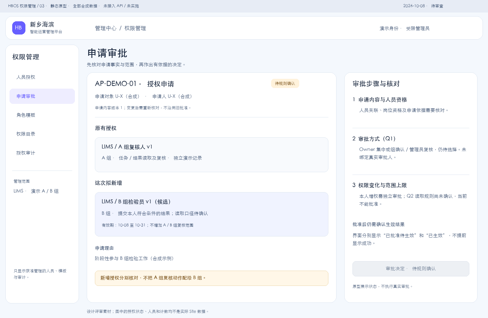
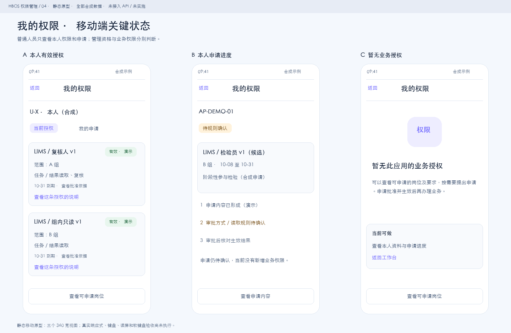

# 权限管理：页面信息架构与原型

- 日期：2026-10-08
- 状态：**REJECTED / NOT_ADOPTED / Owner 已明确否决，不作为复刻依据**。
- 最新方案：[人员与权限管理：岗位关联原型 V2](人员与权限管理_岗位关联原型设计.md)已获 Owner 接受；接续[Portal 组合展示设计](人员与权限管理_Portal组合展示设计.md)也已获 Owner 确认（2026-10-08），作为后续复刻基线。本旧稿仍不采用。
- 工作分支：m2-r11@27d3558；保留前序变更，不创建或切换分支。
- 本轮：第四步，形成页面结构、静态原型及交互规格；Owner 随后要求 HTML 模拟图，追加独立交互原型，继续不动现有应用代码。
- 依据：[业务矩阵](../plans/权限管理_业务权限矩阵与授权流程草案.md)、[后端详细设计](../plans/权限管理_后端详细设计与实施拆分.md)、[可扩展契约](../plans/权限管理_可扩展授权契约与LIMS试点规格.md)、[前端实施规范](FRONTEND_IMPLEMENTATION_GUIDE.md)。

首批交付 Markdown、可编辑 SVG 与 PNG 预览，全部为合成数据。之后按 Owner 要求追加[HTML 交互模拟](prototypes/权限管理_交互模拟.html)：原型内的导航、草案及撤销示例仅操作页面内存，刷新后恢复。没有新增真实应用路由、Vue 组件、API 调用、持久化存储或实际授权操作，不覆盖 5178 真实应用。指定 frontend-design / superpowers 在当前环境不可用，按项目规则人工设计与核对，不安装或替换其他 Skill。

Q1 审批方式、Q2 检验员读取范围仍未选择；[P1 实际盘点](../plans/权限管理_P1环境只读盘点记录.md)保持 PARTIAL / NOT_RUN。静态示例不批准具名人员、业务规则或实际授予。既有 P4-F6-5 保持 REVIEWING，S01—S06 仍 NOT_STARTED / 验收 NOT_RUN。

## 1. 两种入口及页面边界

沿用原建议的日常 Portal 管理入口候选，展示授权解释、人员范围、申请 / 审批与审计；业务 App 仍执行具体记录权限。Desk 保留受限专业维护和应急入口，优先复用原生 Workspace、列表、表单与 Report，不复制后台全部设置页。两种入口调用同一后端命令、引用同一授权事实；可进管理页面、可审批以及可执行业务分别判定。

这一 Portal 候选解决跨应用的人员授权核对、范围和版本解释、差异审批及员工自助等交互，复用既有 Portal 壳和组件；不替代 Desk 单据配置，也不增加独立人员库。页面分工仍须 Owner 审查。原生对象直接编辑不能绕过审批、生效与撤销流程；维护或应急能力不自动获得质量签署或全员权限。

| 入口 / 身份 | 可见内容候选 | 边界 |
| --- | --- | --- |
| 日常授权管理员 | 管理范围内人员、可授模板、授权、申请与审计 | 管理范围内计数与搜索；无全员默认枚举，本人增权需独立审批 |
| 审批人 | 分配给本人的申请及必要证据 | 不能凭审批资格直接改模板、任意授权或取得业务权限 |
| 普通人员 | 本人权限、本人申请及可申请目录 | 不显示他人授权、员工详情或管理审计；代申请另验边界 |
| 技术运维 / 专业维护 | 获准的 Desk 维护入口 | 不根据 System Manager、用户类型或组长身份推定统一管理权 |

入口名称暂用“权限管理”；与现有“系统配置”“个人资料”保持区分。普通人员入口暂用“我的权限”，不显示管理导航。进入入口的资格来自后端；直达地址、返回页面或旧按钮仍须重新核对。

## 2. 信息架构及首批页面

管理入口包含人员授权、申请审批、角色模板、权限目录、授权审计五个栏目；本人权限位于个人入口。应用筛选来自后端获准目录，首批原型用 LIMS 举例，后续应用按已安装且可用的定义扩展；没有固定的所有未来应用菜单。

| 编号 | 页面 / 区域 | 核心信息与动作 | 本轮图示 |
| --- | --- | --- | --- |
| P01 | 人员授权 | 获准主体、应用、岗位版本、完整范围、有效期、状态；进入申请 | 图 01 |
| P02 | 人员授权详情 | 按条展示角色 + 范围 + 期限 + 批准依据；查看历史、发起变更 / 撤销 | 图 01 右侧详情 |
| P03 | 授权申请 | 选人员 → 选应用 / 角色版本 / 范围 → 核对期限、理由与变化 | 图 02 |
| P04 | 申请审批详情 | 固定申请内容、变化、资格 / 范围核对、审批步骤及结果 | 图 03 |
| P05 | 角色模板 / 版本详情 | 中文动作、固定版本、适用范围、受影响授权；申请新版本 | 本节结构规格 |
| P06 | 权限目录 | 获准应用下已登记动作、实现 / 可授状态与中文解释，只读 | 本节结构规格 |
| P07 | 授权审计 | 受限事件列表与时间线，关联授权、申请、操作人、原因与结果 | 本节结构规格 |
| P08 | 我的权限 / 我的申请 | 本人按条授权、到期时间、申请进度和无权限说明 | 图 04 |

P01 / P02 不把人员全部角色、组和动作分别平铺后组合解释。例：U-X 在 A 组为复核人，在 B 组为只读人员，则 A 组复核、B 组只读各自成条；界面不显示“复核 A / B 两组”。批准依据尚不可核验时标为“依据待核对”，不补造批准人。

P05 采用模板列表 + 版本详情：已批准版本只读，增权生成新候选版本，展示新增 / 移除动作、范围变化和受影响授权。发布新版本不自动升级人员；未实现动作不可选，无“全部功能 / 自动包含新增功能”开关。跨应用岗位包生成多条独立授权并逐条展示。

P06 采用应用分组列表 + 动作解释：动作中文名优先，稳定 ID 仅在专业详情按需显示；目录只读，不编辑处理函数、SQL 或范围表达式。无模板管理权限的人只看到获准可申请目录。

P07 采用事件列表 + 时间线：主体、应用、事件、结果、操作人、时间、理由；审批与生效分开呈现，撤权保留历史。首批不提供批量授权、批量清空角色、原始配置导出或全量人员导出；审计访问仍按管理边界限制，计数不先计算全库。

## 3. 静态原型

以下四张图是布局及关键状态的人工设计示例，不是运行态截图。合成人员 U-X / U-Y、检验组 A / B 与记录编号不对应实际 Site。

### 图 01：人员授权及逐条解释



[可编辑 SVG](prototypes/权限管理_01人员授权.svg)。使用管理范围内列表与人员详情，明确岗位版本、范围、动作与到期时间。三个“有效”示例均为演示记录，不表示真实授权已创建。

### 图 02：申请及规则待定状态



[可编辑 SVG](prototypes/权限管理_02授权申请.svg)。候选申请选定 LIMS 检验员 v1 / B 组；Q2 读取口径没有默认值，显示待确认且阻止提交。长期授权需要单独批准，不因空截止日期自动成立。演示有效期采用 2026-10-08 至 10-31，11-01 零点失效；图中使用 Asia/Shanghai 展示，正式 Site 时区仍待盘点确认。

### 图 03：审批核对与变更解释



[可编辑 SVG](prototypes/权限管理_03申请审批.svg)。示例显示固定申请修订及新增授权内容，A 组原复核授权与 B 组申请分别说明；Q1 / Q2 尚未确定，审批按钮不可执行。审批通过与授权生效是两个明确状态，不提前显示成功。

### 图 04：本人权限、进度与无权限状态



[可编辑 SVG](prototypes/权限管理_04我的权限.svg)。覆盖本人有效授权、申请待确认和缺少权限。没有业务权限时可查看原因、按获准目录申请或返回，不能从空状态进入全员管理。

## 4. 关键交互及状态

| 场景 | 候选交互 | 服务端结果与展示 |
| --- | --- | --- |
| 申请新增或增权 | 固定人员、应用、版本、范围、期限与理由，显示按条差异 | 先检查管理 / 代申请边界与规则；未定口径只保留设计中的草案状态，不提交真实申请 |
| 审批 | 核对固定修订、资格、本人受益与范围上限；要求理由 | 内容已变则重新载入并再次确认；不沿用旧审批内容，拒绝与退回分开 |
| 批准后生效 | 仅获准执行人可生效，或经批准的服务端流程执行 | “已批准，待生效”与“已生效”分开；未知结果先查询，不能假定成功或重新建一条 |
| 修改范围 / 模板 / 期限 | 原授权只读，新申请说明扩大或收窄及生效顺序 | 不把普通编辑等同于增权；替换与撤回旧授权的原子规则未定前不能启用该操作 |
| 撤销 | 先选择具体一条授权，说明人员、应用、角色、范围及生效影响，填写原因后确认 | 重验权限与修订；成功后刷新列表和详情，已完成的业务历史保留 |
| 到期 / 调岗 | 展示实际有效状态和将到期提示，发起新申请 | 不自动续期或授予新组；到期不依赖界面或定时提示判断 |
| 角色升级 | 查看新旧动作及范围差异，再发起明确升级申请 | 旧授权仍固定旧版本；未批准升级不显示新增动作获准 |
| 网络或服务故障 | 保留输入、显示重试；不沿用旧“允许”信息继续写 | 写命令返回不明时先查询状态；重试使用同一操作标识，页面不展示秘密或堆栈 |

请求状态候选：草案 → 待核对 / 待审批 → 已批准待生效 → 已生效；另有退回、拒绝及失效状态。授权状态候选：待生效、有效、已撤销、已到期或因模板 / 动作停用而失效；审批状态不冒充授权状态。后台最终状态命名待实施时定案。

图 02 的“保存草案”为待实施能力，须明确受控后端草案命令、可见范围及保存期限；本轮没有持久化表单。含人员及范围的未完成输入默认不写入 localStorage，不提前引入浏览器中的授权副本。

HTML 原型的“保存演示草案”“确认撤销（仅演示）”仅用于检查候选体验，临时保存在页面内存；后端草案、审批、生效和撤权能力仍未实施。原型视角切换也是评审控件，不能带入生产页面充当管理权限切换。

| 界面状态 | 表达与动作 |
| --- | --- |
| 加载 | 局部骨架与明确加载文案；不短暂展示全量人员或上一主体的数据 |
| 空列表 | “当前管理范围内暂无授权”，保留获准申请入口；不显示全平台人员数 |
| 无管理权 | 显示“当前账号没有此页面的管理权限”，可返回本人入口；不发出他人详情查询 |
| 本人无权限 | 显示明确原因与可申请入口；业务入口资格和实际动作分别说明 |
| 身份关系缺失 | 显示“人员关联待核对”；不从缺少 Employee / 组信息推定 ALL 或否定所有合法用户 |
| Q1 / Q2 未定 | 明确规则待确认，相关提交 / 审批禁用，不默认选中建议项 |
| 后端拒绝 | 显示业务拒绝及可追踪编号，保留正常会话；不把 403 等一律当作退出登录 |
| 修订冲突 / 定义失效 | 显示变化说明并重新核对；未经确认不扩大授权或替换模板 |

“有效”及 allowed_actions 仅说明后端当前返回的事实；按钮可见性不替代提交时的服务端检查。前端不得将 User、scope、批准人或已允许动作列表作为可信许可传回。

## 5. 视觉、组件及响应式

参考现有 [Portal Tokens](../../frontend/hbos-portal-web/src/theme/tokens.css)、[Typography](../../frontend/hbos-portal-web/src/theme/typography.css) 与 [package.json](../../frontend/hbos-portal-web/package.json)：候选复用 Vue 3 + Ant Design Vue 4.x，不混用新组件库，本轮不安装依赖。

| 项 | 原型约定 |
| --- | --- |
| 色彩 | 画布 #f4f8fd、正文 #17253c、次要文字 #425675、品牌紫 #675fff；淡色状态背景配深色文字，不只靠颜色表达 |
| 字体 | 沿用现有系统 / PingFang / Inter 字体策略；标题 30、区块 20、正文 14、辅助 12，关键内容不缩至 10 |
| 布局 | 复用 Portal 外壳；管理区最多 1440 宽，8 / 16 / 24 间距，侧导航 + 主列表 + 按需详情 |
| 组件候选 | Table / List、Tabs、Form、受限 Select、DatePicker、Steps、Drawer、Descriptions、Tag、Alert、Modal、Empty、Skeleton |
| 亮暗 | 本轮只形成亮色原型，暗色未设计 / 未验收；不推定现有主题切换已覆盖新增页面 |
| ≥1200 | 列表与详情并排；动作、范围、期限清晰，长内容可展开 |
| 768—1199 | 列表为主，详情改抽屉或独立区域；保持字段可达，避免挤压范围文字 |
| <768 | 本人信息采用按条卡片，详情全屏；申请单列、固定动作区预留滚动和软键盘空间 |

桌面原型画布 1440×940；移动画布包含三个 360 宽的关键状态示意。组件命中区至少 44×44，键盘顺序从筛选到列表到详情，弹层进入后聚焦标题 / 首个控件，关闭后回到触发处；真实焦点、对比度、读屏、缩放、响应式和软键盘测试全部 NOT_RUN。静态画图核对不表示满足正式无障碍验收。

## 6. 原型审查与后续条件

Owner 可审查：页面分工是否符合日常管理、按条范围是否易理解、申请 / 审批 / 生效是否清晰，以及移动端本人入口是否足够。Q1 / Q2 属于业务规则选择，视觉审查不能替代；具体人员与权限映射仍等待 P1。

[前端实施规范 §2.2](FRONTEND_IMPLEMENTATION_GUIDE.md#22-owner-审查阶段)明确：“未经 Owner 审查通过，不得进入前端复刻阶段。”因此下一步先审查这批原型并调整；审查通过后也须单独明确编码范围并满足后端、实际盘点与隔离验证条件，才开展复刻或功能接入。没有原型批准、没有编码启动或真实权限切换结论。

本轮状态台账、M2 门禁与公共入口同步为 UI_PROTOTYPE_DRAFT；未创建新里程碑子轮。原后端设计为 BACKEND_DESIGN_DRAFT，业务矩阵为 BUSINESS_MATRIX_DRAFT，P1 为 PARTIAL / NOT_RUN，各自未决条件继续保留。

## 7. 本轮核对记录

2026-10-08 已查看四张 PNG，修正到期计数及撤销对象说明；四对 SVG / PNG 均可解析，画布 1440×940，SVG 无脚本、外部图片或事件处理。八个页面清单、六处当前状态、新增本地链接与文档表格核对通过，git diff --check 通过，无未合并索引，分支和 HEAD 不变。工作区变更均为文档或静态设计资产，前序内容保留。

上述仅是静态设计及文档核对；未运行应用、权限、原生入口、撤权并发、响应式或无障碍验收，未代表 Owner 原型批准。CLAUDE / AGENTS 已检查，其协作规则不承载进度，无需修改。

## 8. HTML 交互模拟 — 2026-10-08

Owner 要求“给我一个 html 模拟图”，本轮在独立设计目录交付单文件 [权限管理_交互模拟.html](prototypes/权限管理_交互模拟.html)。内嵌样式、图标与合成数据，无 CDN、API / 外部资源请求、实际账号或持久化存储；可以直接用浏览器打开文件。CSP 明确禁止脚本网络连接、外部资源和表单对外提交，实际服务端授权尚未实现。

本机预览：[打开 HTML 模拟图](http://127.0.0.1:5196/%E6%9D%83%E9%99%90%E7%AE%A1%E7%90%86_%E4%BA%A4%E4%BA%92%E6%A8%A1%E6%8B%9F.html)。独立 Python 静态服务仅监听 127.0.0.1:5196，服务目录为本节设计资产目录；未改动 5178、5188、Docker、Site 或后端服务。若预览进程结束，仍可直接打开保存的 HTML 文件。

```sh
python3 -m http.server 5196 --bind 127.0.0.1 --directory '/Users/hbzl/Vibe Coding/HBOS-Platform/docs/frontend/prototypes'
```

可查看人员授权、申请审批、模板、目录、审计与本人视角；支持搜索筛选、授权详情、草案填写、按条撤销演示、重置及手机布局切换。Q1 / Q2 保持未选择，提交及审批按钮仍不可执行；不存在真实权限生效。

浏览器检查：已验证搜索与详情同步、草案保存及审批禁用、四个管理菜单切换、按条撤销演示及对应审计、本人与管理员视角分开；查看桌面和 390 宽的本人模拟布局，所查布局无页面横向溢出。JavaScript 语法、独立资源与无网络 / 持久化引用检查通过。这仅验证 HTML 原型，真实权限、所有断点、设备、读屏及后端验收仍 NOT_RUN。

[桌面预览截图](prototypes/权限管理_HTML桌面预览.jpg)、[手机模拟布局截图](prototypes/权限管理_HTML手机预览.jpg)为这份 HTML 的浏览器截图，和 §3 人工画出的静态图分别保留；均不是 HBOS 运行态验收。
