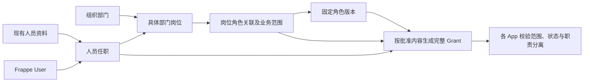

# 权限管理：岗位、任职与角色关联后端契约

2026-10-10 最新接续：[原站只读预检](../milestones/M2_人员权限原站只读预检记录.md)已完成，**S02_ORIGINAL_READONLY_PREFLIGHT_COMPLETED / PARTIAL / REVIEWING / 5178_REAL_READONLY**。实际frontend / DB摘要精确匹配，五来源InnoDB与24必需列PASS，COUNT18/0/1/14/31；八管理表全缺，正式预检在tables以STORAGE_PREFLIGHT_SCHEMA_INVALID停止。10诊断SELECT含正式预检2，零transaction_writes、rollback/destroy PASS，未初始化。只读诊断完成不等于结构或启用PASS；管理GET仍NOT_READY。原站备份工具release路径缺失，现已有镜像 / 权限 / 磁盘 / 备份总量仅元数据确认，原样stdin备份操作包已准备但未执行。下一段先确定停写一致性窗口 / 原服务恢复措施，再按同次私有备份与隔离SQL恢复范围执行；不建表 / 人员 / 政策 / pins或启GET。5178既有真实只读；本段未改代码 / 配置 / 服务 / 缓存 / schema，未备份 / 恢复或浏览器复验。前段14原生 / 428离线PASS为历史证据，本段未重跑。S01-B/S02 PARTIAL，C/S03—S06 NOT_STARTED，Grant NOT_RUN，P4-F6-5 REVIEWING；原Q1/Q2、Date、固定P1 / 完整恢复 / Owner及管理门禁保留。 以下为前序交付当时的记录。

2026-10-09 最新接续：[管理边界与受控接口实施规格](../milestones/M2_人员权限管理边界与受控接口实施规格.md)已形成，状态 **S02_MANAGEMENT_API_SPEC_DRAFT / REVIEWING**。明确独立具名管理政策、完整规则及人员 / 组织范围、固定操作与期限、写请求回滚 / 重启和同键重放；24 项新政策 / 接口验收全部 NOT_RUN。本轮仅文档变更，未创建政策表 / 接口 / 真实配置，前序 134 项离线及 19 项数据库场景通过不覆盖本规格。下一段仅实现纯管理政策协议与离线判定，不连接 Site、不开放写 API；S01-B / S02 PARTIAL、C / S03—S06 未开始、真实岗位授权 NOT_RUN。5178 真实只读；具名管理人、Q1 / Q2、Date 资格、固定 P1 / 恢复 / Owner 门禁保留。以下为前序交付与设计历史。

2026-10-09 最新接续：[实时来源与管理边界验收](../milestones/M2_人员权限S01B实时来源与管理边界验收记录.md)的 **3 项并发回归已按 Owner“继续”指令补验 PASS**，此前审批连接中断的执行缺口已补齐。本次未修改源码，前段 134 项离线、10 项真实来源 / 管理边界及 6 项存储回归结果沿用，摘要核对一致；累计 **19 项实际数据库场景 PASS**。合成数据已清理，原生指纹一致、六表归零。状态仍 **S01_B_NATIVE_SOURCE_VALIDATED / PARTIAL / REVIEWING**，S01-B / S02 PARTIAL、C / S03—S06 未开始，真实岗位授权 NOT_RUN。下一步细化真实管理边界配置与受控接口；5178 真实只读，Q1 / Q2、具名管理人、员工资格、固定 P1 / 恢复 / Owner 门禁保留。下方保留前序设计与历史证据。

2026-10-09 最新接续：[S02 隔离数据库验收](../milestones/M2_人员权限S02隔离数据库验收记录.md)已完成，状态 **S02_PREVIEW_STORAGE_VALIDATED / PARTIAL / REVIEWING**。既有空 Preview 完成备份和六类 DocType 定向同步，物理约束 / UTC 精度、6 项实际事务 / ORM 测试、3 项独立连接并发验证及 121 项离线测试 PASS（新保护 4 + 前序回归 117）；合成数据已清理，原生数据指纹保持。5178 未迁移，服务默认关闭，保持真实只读。S01-B / S02 仍 PARTIAL，下一步补可信实时来源与来源变更 / 管理边界验证；C 与 S03—S06 NOT_STARTED。下方保留前序设计和交付证据，未建表 / 未验证描述仅代表当时状态。

2026-10-09 最新接续：[存储方案](../milestones/M2_人员权限岗位任职存储与版本方案.md)后的[来源适配基础](../milestones/M2_人员权限S01B来源适配实施记录.md)已实现：精确来源引用、关联歧义、组织父链与 UTC 映射通过合成验证。新适配 37 项及 A 回归 28 项 PASS，所有结果运行未验证，不授予权限。B 仍 PARTIAL；下一段实现 S02 基础岗位 / 任职存储与受控服务，本文逻辑契约和真实生命周期门禁继续适用。

- 日期：2026-10-08；版本：0.1。
- 状态：**POSITION_AUTH_CONTRACT_DRAFT / 关系契约保留待审项；S01-A 已实现，真实岗位授权未接入**。
- 分支：`m2-r11@27d3558`，沿用 Owner 已指定分支，未创建或切换分支。
- 授权依据：Owner 已接受[岗位关联 V2 原型](../frontend/人员与权限管理_岗位关联原型设计.md)及[Portal 组合原型](../frontend/人员与权限管理_Portal组合展示设计.md)，前端复刻后指示“进入下一步”。本步补齐后端关系契约，不启动真实接入。
- 本轮主文档：本文；不新增里程碑子轮，P4-F6-5 保持 REVIEWING。[前端复刻](../frontend/人员与权限管理_前端复刻实施记录.md)已接续 5178_REAL_READONLY / REVIEWING，原型接受不等于真实权限验收。
- 上位规则：[可扩展授权契约](权限管理_可扩展授权契约与LIMS试点规格.md)、[IAM 字段映射](权限管理_IAM对齐与首批字段映射.md)、[业务矩阵](权限管理_业务权限矩阵与授权流程草案.md)、[后端实施拆分](权限管理_后端详细设计与实施拆分.md)。本文细化岗位关系；统一身份、完整 Grant、App 业务守卫及原生路径闭环规则继续适用。

## 1. 面向已确认页面的业务关系

人员信息和权限管理继续采用已确认的两个页面。人员选择具体部门岗位，岗位关联角色；服务端把符合生效条件的任职与岗位角色关联展开为完整人员授权。用户不需要在人员表中反复给每个人勾选同一套功能。



“检验员”可以是通用岗位名称；“化验一组的检验员岗位”和“无菌检验组的检验员岗位”是两个具体岗位。人员可有主岗和兼任，主岗用于展示和组织归属，不自动压制或放大兼任权限。权限管理中的角色可以跨应用展示，但实际授权仍按 App 分条保存。

本契约不增加第三个主页面。现有编辑弹窗承载资料或变更草案；真实接入后，“保存资料”“提交授权变更”“授权已生效”须返回准确结果，不能沿用 Mock 的内存保存效果假称真实授权成功。审批可以作为受控服务步骤，不要求重建已否决的申请中心式界面。

## 2. 人员、组织与账号的数据归属

| 对象 | 权威来源与引用 | 页面及授权约束 |
| --- | --- | --- |
| 登录身份 | 现有 Frappe User / Session；授权主体为 User.name | 复用账号服务，不新建 Portal User、密码或认证会话 |
| 内部人员资料 | 已存在的 Employee；字段候选为 name、employee_number、employee_name、cell_number、status | 人员 ID 显示工号，引用使用明确的来源类型和主键；手机号、姓名不作身份匹配键 |
| 员工与账号关联 | Employee.user_id → User | 必须由可信关联确认；实际多关联、日期和公司资格核实后才可用于授权，不按邮箱、姓名或手机号自动合并 |
| 没有账号的员工 | 已有 Employee，user_id 为空 | 可在获准范围内维护资料和任职，显示“账号未关联”；不生成业务 Grant，不自动开账号 |
| 没有 Employee 的账号 | 现有 User 的最小投影 | 显示“人员资料待关联”，可提供获准的关联体验；不伪造 Employee，不自动认定为内部检验人员 |
| 公司与部门 | Company / Department；实际字段、树关系和自定义变更待 P1 核实 | 人员列表筛选使用组织引用；部门树不是全部业务资源的授权树 |
| 通用岗位名称 | 若目标 Site 存在且适用，复用 Designation 或后续组织模块的岗位类别 | 只描述岗位类别，不能仅凭名称决定授权 |
| 具体部门岗位与任职 | 组织 / 人员模块的权威关系；当前尚无已核实运行实现 | 本文定义服务契约和候选字段，存储归属待定；IAM 不复制人事主数据 |
| 检验组等业务范围 | 各 App 资源主数据；LIMS 为 HBOS Lab Department | 必须显式选定真实稳定引用；不把同名 Department 当成检验组 |

当前仓库已有[考勤人员页面的数据服务](../../apps/hb_attendance_app/hb_attendance_app/hbos_attendance/page/hbos_employee_management/employee_management_data.py)，读取 `Employee` 的工号、姓名、部门和联系方式。这证明已有资料来源可复用，不证明该服务已经满足新页面的部门管理范围、多任职或脱敏要求；不直接套用其全量 HR 角色查询作为新授权接口。

人员查询以 `person_ref = {source_type, source_id}` 区分 Employee 与仅有 User 的投影；这个引用是 DTO，不是新人员身份表。同一 User 的关联明确时合并显示，无法确定时展示待核对状态，拒绝依赖员工资格的授权。多公司或多 Employee 不能简单取第一条，也不能未经业务确认批量停用账号。未来人员模块作为权威来源时通过受信任适配衔接，保留原关联、授权历史和审计来源。

“新增人员”后续调用已授权的人事主数据服务；账号创建、关联及交接调用现有受控账号服务，不能由权限页面私自写 User 或凭手机号新建身份。具体资料写入 API 在人员管理范围批准后另行对齐，本步不实现。

## 3. 最小关系模型及版本

以下是逻辑模型和字段候选，不是已创建 DocType，也不指定新的 Frappe App。具体关系存储优先归属组织 / 人员模块，授权版本、审批和 Grant 归属统一后端授权模块；在目标 Site 盘点后确定 Link、唯一约束和索引。

| 逻辑对象 | 最小字段候选 | 必须保证的关系 |
| --- | --- | --- |
| 具体部门岗位 Position | position_id、department_ref、company_ref、position_type_ref（可空）、title、status、revision、authorization_generation | ID 不由部门 / 岗位名称拼接；同名不同部门不合并；来源、公司和部门关系须一致 |
| 人员任职 Assignment | assignment_id、person_ref、subject_user（可空）、position_id、is_primary、valid_from / valid_until、status、revision、authorization_generation、source_ref | 每条任职独立引用具体岗位；账号、人员与任职必须可追溯，不能自由填其他 User 冒充关联 |
| 页面角色 Role Bundle | role_id、title、description、created_at、status、revision、authorization_generation | 供角色表使用的稳定业务组合；不等同于原生 Frappe Role 名称 |
| 页面角色版本 | role_id、version、components、approval_ref、status | components 明确引用各 App 的模板键及固定版本；批准内容不可原地改写 |
| 岗位角色关联 Binding | binding_id、position_id、revision、authorization_generation、status | 关联的稳定身份；“关联岗位”必须验证目标岗位管理边界 |
| 岗位角色关联版本 | binding_id、version、role_id / role_version、component_scopes、valid_from / valid_until、approval_ref、status | 每个角色组件分别携带本 App 的完整范围；不只有一个共用 scopeLabel |
| 任职授权生效批准 | approval_ref、assignment 修订、binding 版本、角色 / 模板版本、范围、期限、policy_version、内容摘要 | 批准的是固定内容；可按明确具名人员批量办理，不能批准无限未来人员 |
| 完整 Grant 来源补充 | assignment_id / 修订 / generation、position_id / generation、binding_id / 版本 / generation、component_id、role_id / 版本 / generation、approval_ref | 沿用已有 Grant 字段；每条 Grant 能追溯到任职、岗位、范围和批准依据 |

`revision` 用于乐观并发控制。`authorization_generation` 用于终止旧关系所派生的授权：岗位移属、任职终止、关联停用等失效变更必须递增并使旧来源失效。纯显示名称修改不改变授权语义；新角色 / 关联版本的草案或批准也不自动切换既有人员的版本。具体字段落点与事务 API 仍待目标版本验证。

模板及关联的批准版本不可变，旧版本是否仍允许使用有明确状态。普通新增功能通过新版本和显式升级申请处理；安全停用则立即阻断相应旧引用。停用后重新启用不能恢复旧 generation 的 Grant，需重新确认有效任职、版本及批准依据。

角色表的创建时间取稳定角色记录的创建时间，版本批准时间另行保留。角色删除和岗位删除若存在任职、Grant 或历史引用，使用停用 / 退役并保留历史；只有从未使用的草案可在有权范围内删除。

任职最小结构约束：同一人员在同一时段最多一条有效主岗，可以有多条明确批准的兼任；同一人员与同一具体岗位的重复重叠任职不能静默生成重复授权。没有主岗或资格未确认时可保留资料，但不由服务端随意挑选主岗。主岗用于展示的规则不代表跨公司业务资格已批准，跨公司任职仍需核对实际人员来源与业务条件。

`Employee.department` 保留既有人事含义，任职的部门由其具体 Position 取得。新增兼任不能暗改 Employee.department；主岗变动涉及人事字段时走受控人员服务并处理现有业务影响，不能由 IAM 单独改一份部门副本。人员资格状态、任职事实状态和授权审批状态分别保存 / 投影，“任职有效”不等于“业务授权已批准”。

## 4. 从岗位到完整 Grant 的生效规则

### 4.1 固定组合，不拼接动作和范围

服务端按“有效任职 × 已批准岗位角色关联版本 × 角色内 App 组件”形成授权候选，每个候选都具备本条的 User、App、模板版本、完整范围、期限及来源批准。候选不是生效 Grant；还须通过当前人员资格、管理边界与固定内容批准。

例：合成 User U-X 兼任 A 组复核员和 B 组检验员，生成两条彼此独立的 LIMS Grant。第一条包含 A 组复核动作及 A 组范围，第二条包含 B 组提交动作及 B 组范围。不能取得 B 组复核权；即使同时任检验和复核岗位，仍不能复核自己的结果。

| 条件 | 契约要求 |
| --- | --- |
| 动作 | 使用 App 注册的明确 ID 和固定模板版本；未知、未实现、退役动作拒绝 |
| 范围 | component_scopes 逐组件保存类型、schema_version、维度、对象引用及包含下级选项；空值不能解释为全量 |
| 同一条 Grant | 动作匹配后，本条全部必要条件取 AND；同一维度对象集合按 App 注册语义解释 |
| 多条 Grant | 完整满足的 Grant 之间取 OR；不合并成全用户的动作池 × 范围池 |
| 有效期 | 开始取批准内容、任职、关联、模板适用期和委派限制的最晚开始；截止取所有有限上限的最早截止；区间为空则拒绝 |
| 长期授权 | 各层没有有限截止仍须明确批准长期，不能将 null 默认解释为永久 |
| 人员资格 | User 有效、关联无歧义、任职及所需员工资格有效；主岗不自动代表所有兼任资格 |
| 生效结果 | 数据库唯一生效键绑定批准修订及候选组件；重复请求不得多生成授权，具体约束实现待验证 |

生效时保存经校验的完整范围快照和来源引用；请求时同时检查当前 User、人员资格、Assignment、Position、Binding、Role Bundle、模板及动作是否仍有效，并比较应有的来源 generation。不得只实时展开未版本化的岗位配置，也不得只看旧快照忽略离职、岗位停用或撤权。范围归属以 App 的真实记录解析为准。

Q2 若批准“本人负责”，本人条件与检验组条件同时存在，按请求时会话 User 和实际 assignee / analyst 判定；不能把“本人负责”中文文案当作范围结构。目前这类注册结构和过滤适配尚未实现，Q2 未选前不生成真实读取授权。

### 4.2 任职办理与授权审批的衔接

人员管理员可以在获准部门记录任职事实，业务授权由独立的管理边界控制。任职批准可以与固定岗位授权内容合并办理，减少重复操作；但须具备具名审批人、明确范围上限和版本，并遵守 Q1 最终选定流程。尚未批准的任职授权显示“待生效”，不能因人员匹配岗位就跳过批准。

关联版本批准后，当前人员只有被明确纳入变更批准清单才升级；未来新增任职也必须核对该任职的人员资格及批准内容。岗位模板可复用，不能成为给任意未来用户自动授权的无限授权书。管理审批、角色维护、任职维护和业务签署分别验证，HR Manager、System Manager 或组长字段不能代替独立管理授权。

本人受益的直接或间接增权，都必须排除自审批：包括把本人加入高权岗位、给本人岗位关联新角色、升级角色功能、扩大范围、延长期限，以及修改管理委派。没有独立有权审批人的情况保留治理缺口，不能自动通过。

## 5. 变更生效、撤销与并发

| 触发 | 对既有授权的处理 | 新授权及页面反馈 |
| --- | --- | --- |
| 新人员匹配岗位 / 新增兼任 | 不扩大已有 Grant | 展示拟派生角色；资格和固定内容批准后生效 |
| 调岗或结束兼任 | 旧任职在事实生效时失效，所属 Grant 随之拒绝；其他有效兼任保持 | 新任职单独核对并批准，不能在审批等待期沿用已终止旧权限 |
| 修改岗位所属部门 / 公司 | 属于授权影响变更，核对相关任职，旧来源按生效边界失效 | 不按新部门自动继承业务范围，提交明确迁移内容 |
| 角色增加功能 / 换关联范围 | 生成新版本和影响预览；旧批准版本按原边界保留，除非明确撤销或退役 | 选定人员、版本、范围和期限批准后升级，不把“保存角色”当作所有人增权 |
| 安全停用角色、关联、岗位或任职 | 当前事实立即阻断相应受管授权，更新来源 generation / 主体授权修订 | 清理任务可后续补审计状态，不能依赖异步任务才停止放行 |
| 到期 / 员工资格失效 / 账号停用 | 请求时按时间及可信当前事实拒绝 | 不因页面缓存、后台任务延迟或会话仍在而继续放行 |
| 重新启用 | 不复活之前已撤销或来源 generation 失效的 Grant | 按当前资格和固定内容重新批准 |
| 账号关联、恢复或交接 | 不按同名、手机号或原生角色搬运 Grant；原受益 User 与来源重新核对 | 与既有账号服务协调受控撤销 / 新授予，不绕过安全版本和审计 |

只有可信的离职、结束任职、停用等事实才触发对应生命周期撤权。一次同步失败、网络不可用或数据源未拉取不能批量写成离职；无法确认当前资格时，对依赖该资格的受管动作拒绝并报告不可用，保留资料维护和排障入口。

预览、提交、审批和生效都校验对象 revision、目录修订、来源 generation 与批准内容摘要；服务端重新计算候选、范围和影响人员，客户端提交的人数、角色摘要或 preview_id 不能作为许可。任何依赖已变化，返回冲突并重新预览 / 审批，不能自动按新版生效。

授权写入和业务敏感写入沿用[事务撤权设计](权限管理_后端详细设计与实施拆分.md#42-写入撤权及审计)的主体授权修订及锁顺序。批量撤权不能只更新名单中一部分就宣称完成：先以共同来源停用状态建立拒绝边界，再分批清理派生记录。批量新增 / 升级在可验证的受控事务中完整生效；超出事务上限则拆为有明确人员和批准内容的子批次，逐批报告，未完成对象维持原有效边界或待生效状态。不得半批静默成功或撤权后回退恢复旧授权。具体锁、隔离级别及批量上限尚未运行验证。

共同来源的拒绝边界也必须参与敏感写入的同一事务及并发校验；不能只在接口开头读一次停用状态，随后不受控提交。增加来源锁或修订校验后，须重新验证统一锁顺序、死锁重试和撤权返回时点；未完成该验证，不宣称异步清理方案已满足并发撤权。

## 6. 与当前 Portal 展示模型的适配

| 当前 Mock 字段或功能 | 真实契约适配要求 |
| --- | --- |
| DemoPerson.id / name / phone | 转为 person_ref、显示工号、来源字段和服务端脱敏手机号；HB001 等合成 ID 不导入真实库 |
| person.positionIds | 返回 Assignment 列表，含具体岗位、主 / 兼任、期限、资格、授权状态和 revision |
| position.departmentId / name | 转为具体 Position 与 Department 引用；同名不合并，名称改变不重新生成岗位 ID |
| position.roleIds / scopeLabel | 转为固定 Binding 版本及逐 App component_scopes；scopeLabel 仅由后端生成展示文字 |
| role.permissionIds | 转为 Role Bundle 版本及各 App 模板版本，功能目录显示稳定真实 ID；未接入能力只显示不可配置状态 |
| 人员“角色”列 | 汇总当前有效 Grant 所对应的角色，详情逐任职显示来源、范围与有效期；待批或无账号单独标记，不假称有效 |
| 搜索角色 / 部门 / 岗位 | 后端在获准人员范围内过滤；角色状态口径与人员行一致，include_children 只决定组织筛选，不扩大业务授权 |
| 角色“保存” / 岗位“确认” | 返回草案、待批或已生效的准确状态及影响摘要，不由前端写入真实批准标志 |

当前演示目录不是后端目录，必须显式适配，不能自动改字符串或按菜单推断授权。以下只是设计对应，不表示动作已接入：

| 演示 ID | 后端语义或处理 |
| --- | --- |
| lims.result.read、lims.review.read | 候选对应 lims.results.read；列表入口不同不意味着不同授予，重复动作按真实目录投影 |
| lims.result.submit | 候选对应 lims.results.submit |
| lims.review.review | 候选对应 lims.results.review |
| lims.quality.approve、lims.sample.*、lims.result.edit | 不直接转成首批授予；批准、样品和录入能力按各自业务接入边界另行登记 |
| warehouse.* | 扩展示例，未有本轮接入规格，不形成可授予真实动作 |
| platform.people.*、platform.roles.* | 展示管理功能；真实管理能力必须使用独立受控管理授权 / 委派，不因普通业务岗位角色取得授予权 |

人员表仍保留 ID、人员名称、部门、岗位、手机号、角色、操作；角色表保留角色、创建时间、描述、操作。真实后端可以返回资格及生效状态供现有行、标签和详情使用，不在表格中暴露 Grant 内部字段或增加复杂配置步骤。

## 7. 管理接口候选

下列名称是服务能力契约，不是本轮创建或开放的 Python 路径。继续采用现有 Portal 的 `ok / data / error.code / retryable / trace_id` 包装，并由 Frappe 方法响应的 message 承载；不混用账号接口错误形状。新增错误码须在实际接入时验证客户端兼容性。

| 能力 | 请求要点 | 响应 / 服务端约束 |
| --- | --- | --- |
| list_people | 已限定的姓名、手机、部门、include_children、岗位、角色、生效状态、分页参数 | 获准人员最小投影、任职与角色摘要、过滤后总数；手机号查询及明文查看另验权限 |
| get_person_assignments | person_ref | 当前与历史任职及授权来源；无权和不存在的目标采用不泄漏存在性的返回 |
| list_organization_positions | 已获准组织根、分页 / 搜索 | 获准部门 / 岗位及来源状态；不能任意枚举 User、隐藏部门或跨边界人数 |
| list_roles / get_role_version | App、角色、固定版本、分页 | 管理边界内的角色、版本与目录；只可授予经注册、已实现且在管理上限内的能力 |
| preview_change | change_kind、目标引用、proposed、expected_revisions、directory_revision | 服务端校验的增减项、受影响可见人员、阻断原因、内容摘要、预览有效期；不写授权 |
| submit_change | 预览引用、原固定内容、expected_revisions、idempotency_key、reason | 重新核对后建立固定变更申请；actor 和审批策略由服务端取得 |
| approve_change / reject_change | request_ref、expected_revision、内容摘要、决定理由 | 核对独立审批人、管理委派、资格、范围和期限；审批绑定固定修订 |
| apply_approved_change | 已批准修订、expected_revisions、idempotency_key | 受控内部执行，重新验证批准有效性，原子生成 / 替换对应 Grant，返回准确结果 |
| revoke_source / revoke_grant | 来源或 Grant 引用、expected_revision、原因、idempotency_key | 按独立撤权管理边界执行、更新拒绝边界及主体修订、留存事件；不依赖新授权审批先完成 |

管理页的读取需要独立资料 / 授权查看边界，不能因会登录 Portal 就看全员。人员、角色、范围、影响人数、搜索建议、详情、统计均在过滤后返回；禁止先全量读取到浏览器再隐藏。角色跨多个管理部门时，普通管理员不能借影响预览读取外部人员或修改其授权；超出边界的整项变更应拒绝或交由覆盖全范围的审批主体办理，不能暗中少算后部分应用。

所有写能力使用会话、CSRF 保护的 POST 和服务端 actor；GET 不产生授权变更。幂等键按 actor、命令和固定请求摘要约束，同键同内容返回同一结果，同键不同内容拒绝。重试不重新扩大人员集合。客户端不可提交 approver、approved、ignore_permissions、任意 DocType / SQL / 方法路径。普通 REST、Desk 表单、原生 Role / Role Profile、DocShare、交接服务及后台任务的旁路，仍须按原生闭环验收逐项覆盖。

候选错误语义：VALIDATION_ERROR（不合规内容）、FORBIDDEN（无管理权限）、REVISION_CONFLICT（版本已变化）、APPROVAL_REQUIRED（缺批准）、SOURCE_UNAVAILABLE（依赖事实不可确认）、CAPABILITY_UNAVAILABLE（能力未接入）。后四项为新增候选，尚未进入现有错误注册。业务或管理拒绝不能清除正常会话或伪装成密码过期。

固定变更请求示例（全部为合成引用，不是实际接口调用）：

```json
{
  "change_kind": "assignment_authorization",
  "person_ref": {"source_type": "Employee", "source_id": "EMP-DEMO-X"},
  "proposed": {
    "assignment_id": "ASG-DEMO-X-A",
    "position_id": "POS-DEMO-A-REVIEWER",
    "binding_versions": [{"binding_id": "BIND-DEMO-A", "version": 1}],
    "valid_from": "2026-11-01T00:00:00+08:00",
    "valid_until": "2026-12-01T00:00:00+08:00"
  },
  "expected_revisions": {"person": 3, "assignment": 1, "position": 2, "binding": 4},
  "directory_revision": "demo-definition-1",
  "idempotency_key": "demo-change-001",
  "reason": "合成样例：新增 A 组复核岗位授权"
}
```

其中 subject_user、完整 scopes、实际受影响人员、批准人及策略版本由服务端查验并固定。响应应区分 `draft / pending_approval / applied / rejected / conflict` 等候选结果；返回 pending_approval 时人员页不能显示“权限已生效”。结构字段及状态名称在 S01 / S02 定案，当前没有注册接口或传输请求。

## 8. 扩充与后续人事模块衔接

新增板块仍由 App 注册动作、资源与范围类型；Role Bundle 引用具体 App 模板版本，岗位 Binding 为每个组件配置本 App 的范围。注册新动作不改变旧模板、旧关联或旧 Grant，不自动勾选角色编辑器；不可用模块不能借保留配置放行请求。

组织模块未来提供具体岗位，人员模块提供任职和资格。适配必须声明权威来源、稳定引用、修订及生命周期事件；移交前逐项对账旧来源并验证审计可追溯。原生 HR 字段、导入、Desk 修改、外部同步与授权页面必须共用受控事件 / 失效机制，不能只接 Portal 保存按钮。尚未完成这种覆盖的业务范围不能宣称任职撤权闭环已完成。

部门树移动、包含下级范围及源对象重命名均按实际语义处理。岗位 ID 不随显示名称变化；Frappe 原生对象引用重命名通过受控适配更新关联及失效修订，不凭同名重新绑定。LIMS 检验组目前没有 Company Link，不能把 Employee.company 或 Position.company_ref 当作已完成的 LIMS 公司隔离。

原生 Role / Role Profile 仅作为经核对的兼容投影。不能将一个跨组岗位名称投影为可绕过范围的全局原生高权角色；投影及旧账号交接与 Grant 的一致性留给 S05 验证，现有合法权限不在本步改动。

## 9. 后续验收用例与实施归属

以下为 **POSITION-Axx** 补充用例，全部 **NOT_RUN**；保留既有 IAM 跨域、LIMS-PILOT 和业务矩阵用例。本步文档检查不计为下表通过。

| 编号 | 场景 | 预期 |
| --- | --- | --- |
| POSITION-A01 | 两个部门均有“检验员”岗位 | 岗位 ID、关联与范围独立，改一处不影响另一处 |
| POSITION-A02 | A 组复核 + B 组检验兼任 | A 复核允许、B 复核拒绝，范围不串接；自审仍拒绝 |
| POSITION-A03 | 新增 App / 动作，修改角色为新版本 | 旧人员不自动获得新动作；明确批准升级者才生效 |
| POSITION-A04 | 无账号 Employee、无 Employee User、多关联歧义 | 可按边界维护资料；不误判内部业务资格或生成 Grant |
| POSITION-A05 | 调岗，新岗位授权待批 | 旧任职终止后拒绝旧权限，新权限保持待生效；有效兼任不误撤 |
| POSITION-A06 | 岗位 / 关联 / 角色停用后重新启用 | 当前请求即拒绝；后台清理延迟不放行，重新启用不复活旧 Grant |
| POSITION-A07 | 任职、关联或委派先到期 | 取最早截止，结束时刻即拒绝；延长任一层不能自动延长旧 Grant |
| POSITION-A08 | 管理员给本人岗位扩权 / 改派自己 / 延期 | 间接自增权不能自审批；业务或 HR 角色不能代替管理委派 |
| POSITION-A09 | 预览后目录、人员、任职、岗位或关联发生变化 | 提交 / 审批 / 生效拒绝陈旧内容；要求重新核对固定内容 |
| POSITION-A10 | 重复提交、同键不同内容、批次重试 | 唯一生效、幂等一致；无重复 Grant、半批静默成功或权限复活 |
| POSITION-A11 | 撤权与敏感业务写入同时发生 | 符合已验证串行边界，撤权完成后不提交未获准写入 |
| POSITION-A12 | 人员搜索、手机号、总数、影响预览及组织下级 | 先按管理范围和字段查看权限过滤，不泄漏隐藏人员或扩张业务范围 |
| POSITION-A13 | Department 与检验组同名、公司缺失、树移动 | 不按名称或员工公司推导业务授权；范围变更受控 |
| POSITION-A14 | Desk / REST / 导入 / 同步 / 交接绕过页面 | 不能直接伪造批准，生命周期失效和受管资源闭环一致 |
| POSITION-A15 | 数据源不可用、同步漏拉、模块停用 | 不批量误写离职；依赖事实不能确认的受管请求拒绝，不回退全权 |
| POSITION-A16 | 来源改名、人员模块移交、账号恢复 / 更换关联 | 稳定关联和审计不丢失，不按手机号匹配或自动搬运旧授权 |

| 原实施段 | 本契约增加的交付 | 当前状态 |
| --- | --- | --- |
| S01 | 来源适配协议、岗位 / 任职 DTO、角色组件和真实动作目录映射、离线定义校验规格 | PARTIAL；A 28 项离线测试 PASS；B / C NOT_STARTED |
| S02 | 具体关系存储、固定版本、管理范围、预览 / 审批 / 生效与撤权命令 | NOT_STARTED / 验收 NOT_RUN |
| S03 / S04 | 授权来源资格、混合兼任范围、任职撤权及敏感事务验证 | NOT_STARTED / 验收 NOT_RUN |
| S05 / S06 | 既有资料和角色对账、原生入口及交接投影、备份回退和具名试点 | NOT_STARTED / 验收 NOT_RUN |

2026-10-08 后续已完成工程范围复核，见[S01 首段实施范围与离线验收规格](权限管理_S01首段实施范围与离线验收规格.md)。S01-A 只实现纯协议、定义注册与关系结构校验，B / C 承接真实来源及运行注册；本次 A 已完成纯协议实现与 28 项离线测试，B / C 未启动。Owner 明确要求的 5178 真实只读接入也已完成，下一步核实 S01-B 目标来源；详见[实施记录](../milestones/M2_人员权限5178接入与S01A实施记录.md)，不把结构校验或真实读取视为岗位授权生效。

## 10. 未决条件与本轮核对

Q1 审批方式、Q2 检验员默认读取范围及 Q3—Q5 继续以[业务矩阵](权限管理_业务权限矩阵与授权流程草案.md)为准，本步没有替 Owner 选择。固定 P1 来源仍 PARTIAL / 实际盘点 NOT_RUN；目标 P1 的 Employee / Department / Designation 字段、唯一性、人员映射和组织来源尚未核验。当前 5178 / frontend 的只读兼容验证不能替代它。候选关系模型能承接未来模块，不表示现已有一套可运行岗位表。

本轮按规则读取协作入口、项目状态、前端实施记录、M2 Gate、授权设计和上述定点源码；不递归读取 docs。指定 `superpowers` 当前不可用，按项目规则人工完成数据模型和契约核对，未安装或替换技能。

前序契约交付只修改设计文档，未改应用源码；本次已按 Owner 明确指令完成 5178 真实只读页面 / API 与 S01-A 离线实现，验证结果见实施记录。真实岗位授权用例仍未执行，未修改真实账号 / 人员 / 权限或 Site 配置。

状态台账、M2 Gate、公共入口及前端 / 后端接续说明同步更新；CLAUDE / AGENTS 检查后无需修改，继续只承载规则。未提交、推送或部署。
